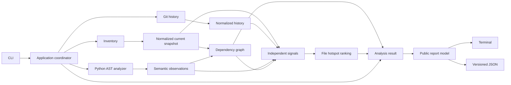

# ADR 0001: v0.1.0 technical architecture

- **Status:** Accepted for v0.1.0 design
- **Date:** 2026-09-24
- **Issue:** [#5 — Define the v0.1 technical architecture](https://github.com/RJChristofoli/Saltline/issues/5)
- **Scope:** Architecture decision only; no product behavior is implemented by this ADR.

## Context and decision drivers

Saltline v0.1.0 must analyze a local Python repository without executing its code. It needs a deterministic file inventory that respects repository boundaries and ignore rules; Git history; Python AST symbols and imports; a dependency graph; separately explainable complexity, churn, ownership, and change-coupling signals; file-level hotspots; and terminal and versioned JSON reports. The CLI must not own analysis rules.

The repository has no product package yet. This decision therefore defines boundaries for issues [#6](https://github.com/RJChristofoli/Saltline/issues/6) through [#15](https://github.com/RJChristofoli/Saltline/issues/15), rather than preserving an existing implementation. The README describes a broader product vision. TypeScript/React, a dashboard, configurable architecture rules, GitHub integration, and agent-driven refactoring are outside this release.

The primary drivers are explainability, deterministic results, a small dependency footprint, independent testing of each stage, and room to add language analyzers or execution strategies after evidence of need. The first release is a local, one-shot analysis; it has no requirement to query previous runs.

## Decision

### Components and dependency direction

Use one Python distribution with explicit package boundaries. The names below describe responsibilities and import direction, not a requirement to create empty packages during scaffolding.

| Boundary | Responsibility | May depend on |
| --- | --- | --- |
| `model` | Immutable or value-like records and contracts for inputs, observations, results, provenance, and diagnostics | Python standard library only |
| `inventory` | Discover and normalize current files under the supplied root; apply ignore and exclusion policy | `model` |
| `history` | Read Git commits and file changes, including recognized renames and incomplete author metadata | `model` |
| `languages.python` | Parse source with `ast`; extract modules, symbols, imports, and locations without importing or executing project code | `model` |
| `graph` | Build and query typed, deterministic internal dependency relations | `model` and normalized inventory/semantic records |
| `metrics` | Produce independent, unit-bearing signals with evidence and availability state | `model`, normalized history/semantic records, and graph queries where needed |
| `ranking` | Rank current files from available signals and retain an explanation of each result | `model` and metric results |
| `reporting` | Construct a public report model and render deterministic JSON and terminal views | `model` and analysis results |
| `application` | Coordinate stages, preserve partial results, and decide whether a run is usable | The preceding boundaries and narrow input interfaces |
| `cli` | Parse arguments, invoke the application, select output, and map run outcomes to exit codes | `application` and output renderers |

Only the application coordinates the pipeline. Data-processing packages must not import `cli`, `application`, or concrete report renderers. Filesystem and Git access sit behind narrow interfaces so fixtures can supply their observations; no generic plugin system or interface for every pure transformation is required. The Python analyzer emits the shared semantic records rather than exposing AST nodes to downstream packages. Future language analyzers can emit the same records without changing graph, metrics, or reporting imports.

The intended initial technology choices are Python standard-library `ast`, `pathlib`, `json`, and a small CLI built with `argparse`; Git history is read through the installed Git executable with explicit argument vectors and no shell evaluation. The graph uses typed adjacency maps built from standard Python collections. A CLI library or graph library can be reconsidered if a later issue demonstrates a concrete need; neither is part of the v0.1.0 contract.

### Execution and data flow

The coordinator reads the current worktree, including uncommitted changes, and separately reads Git history from the selected `HEAD` and history window. It captures each source file once for analysis. The result records the root-independent inventory fingerprint, `HEAD` when available, whether the worktree was modified, analysis options, and diagnostic evidence. The fingerprint is derived deterministically from normalized paths and captured content; the exact hashing and serialization contract belongs to the inventory/report issues. A concurrent edit or disappearance while capturing a file produces a diagnostic. v0.1.0 does not promise an atomic snapshot of the entire worktree.

Stages run synchronously in v0.1.0. Their inputs and outputs are explicit values, allowing independent tests and later per-file parallel analysis without changing the report contract. Output ordering is canonical and never depends on filesystem traversal, Git enumeration, hash-map iteration, or future worker completion order.

### Conceptual model and identity

The shared model distinguishes:

- an analysis snapshot and its provenance;
- current inventory files and their language and metadata;
- Python modules, symbols, source locations, and import observations;
- Git commits, parents, authors, file changes, and rename links;
- typed graph nodes and edges;
- metric observations with units, scope, source window, evidence, and availability;
- ranked file hotspots with component-signal explanations; and
- structured diagnostics with stage, subject, severity, and cause.

Identifiers are deterministic **within a snapshot**, not promises of continuity after arbitrary moves. File identity is a root-relative normalized POSIX path, preserving case. Symbol identity combines that file ID, symbol kind, qualified lexical name, and a deterministic disambiguator for repeated definitions. Source line and column are location metadata, not the identity. Repository absolute paths and machine-specific data are excluded from public IDs. A changed path or qualified name can change the ID; cross-snapshot identity reconciliation is outside v0.1.0.

History retains paths as recorded by Git and maps them to current files only through renames recognized under the documented Git ingestion policy. Ambiguous or incomplete rename chains remain visible as limitations rather than silently attributing history to the wrong current file. The inventory policy controls which **current** files may be ranked; deleted or excluded historical paths may still be retained as evidence needed to explain history and coupling. The precise ignore precedence, symlink handling, history window, merge policy, and author-alias rules are delegated to their implementation issues, but each must be explicit and deterministic.

### Graph and persistence

The in-memory graph has typed file/module/symbol nodes and typed containment and static-import edges. Its primary dependency relation is an import from a Python module or file to another module or file within the analyzed repository. It supports deterministic direct and transitive queries and cycle detection. Symbols are attached to their declaring module/file for explanations; v0.1.0 does not infer a runtime call graph or promise symbol-to-symbol reference resolution. External imports are recorded distinctly from imports that should resolve internally but do not. Unresolved or ambiguous internal references produce diagnostics; no invented internal target nodes are added merely to make the graph connected.

Build the graph and intermediate analysis in memory for each run. Do not introduce SQLite, a graph database, or a cache schema in v0.1.0. The durable artifact is the versioned JSON **report**, not a serialization of the entire internal graph. It includes repository provenance, diagnostics, independently inspectable metrics, file hotspots, and the evidence needed to explain them. It need not support reconstructing every graph query without reanalysis. Persisted analysis can be introduced later behind a measured query or performance need without making storage types part of the model.

### Failures, ranking, and report contract

Diagnostics are structured data, separate from successful observations. A syntax error in one file, incomplete Git metadata, an unresolved import, or unavailable Git history does not discard trustworthy inventory or semantic results. Missing observations remain **missing**; they are never represented as a measured zero. The report exposes whether a run is complete or partial and which signals are unavailable. Failure to identify or read the supplied repository is an execution failure. A valid empty inventory is not such a failure. The ranking policy for missing signals is specified and evaluated by [#13](https://github.com/RJChristofoli/Saltline/issues/13); this ADR requires it to explain the inputs actually used and avoid fabricated certainty.

The JSON has a `schema_version` independent of the Saltline package version. Within a schema major version, compatible additions are allowed; a change requiring consumers to adapt increments the schema major version. Exact field names, numerical exit codes, and a compatibility test fixture belong to [#14](https://github.com/RJChristofoli/Saltline/issues/14). Hotspots are informational in v0.1.0 and do not by themselves constitute a CLI failure or policy violation. A distinct “analysis findings” exit status requires an explicit finding criterion; partial execution must be represented separately from findings and execution failure.

### Testability and evolution

Small synthetic repository fixtures should pin inventory rules, malformed Python, nested and repeated symbols, imports, Git renames and merges, missing author data, cycles, and partial results. Pure stages can be tested from normalized records; input interfaces allow controlled filesystem and Git fixtures. Contract tests should pin JSON schema and ordering. The evaluation corpus in #15 should compare expected hotspots and graph properties, run repeated analyses to detect instability, and document false positives and blind spots on at least one public repository. These checks evaluate usefulness as well as internal correctness; they must not claim that the ranking predicts defects universally.

A later language analyzer may produce shared file, symbol, and dependency observations while retaining language-specific evidence. A later agent workflow may consume versioned reports and cite snapshot-scoped IDs and provenance, but it must not assume those IDs survive renames or that the static graph represents runtime behavior. Persisted indexes, parallel execution, and richer cross-language or agent-facing contracts require separate decisions based on observed use.

## Assumptions and restrictions

- The supported unit is one local repository per run, and users can re-run analysis when the source changes.
- A Git executable may be unavailable; structural Python analysis remains useful without history, with unavailable Git-derived signals reported explicitly.
- The first release does not need interactive graph queries after the process exits or cross-run comparison by stable entity ID.
- Input repositories are untrusted data. Source code is never executed; Git commands use explicit arguments, paths remain inside the selected root under the inventory policy, and diagnostics and output must not embed machine-specific absolute paths by default.
- Python grammar support, maximum repository size, resource limits, and exact metric definitions are chosen and tested in their implementation issues rather than implied by this ADR.

## Alternatives considered

| Choice | Rejected alternative | Reason for rejection in v0.1.0 |
| --- | --- | --- |
| In-memory, one-shot pipeline | Local SQLite or graph database from the start | No current cross-run query requirement; adds migrations, cache invalidation, and coupling between storage and analysis contracts. |
| Explicit contracts and narrow input interfaces | Direct CLI-to-module orchestration | Makes argument handling, analysis control, and failure policy difficult to test separately and risks spreading CLI concerns through the core. |
| Explicit contracts and narrow input interfaces | Full ports-and-adapters framework for every stage | Creates indirection and configuration before there are multiple implementations to justify it. |
| Typed adjacency maps | Third-party graph library or database-native graph | Required import, traversal, and cycle queries are small enough to specify directly; an extra dependency has no demonstrated benefit yet. |
| Snapshot-scoped path and lexical IDs | Permanent IDs across renames and symbol moves | Requires heuristic reconciliation and ambiguity policy that the first release cannot validate reliably. |
| Synchronous coordinator | Parallel workers or asynchronous job queue initially | Adds ordering, lifecycle, and failure complexity without evidence of a performance bottleneck; explicit stage values preserve a path to parallelism. |
| Current-file hotspots | Ranking deleted historical files or symbols as peers | Churn and ownership naturally aggregate to current files, while symbol history and deleted-file actionability are not established. |
| Public report schema | Dumping the entire internal graph as JSON | Freezes internal node and edge representation as an external API and increases output size without a v0.1.0 consumer. |

## Consequences and risks

- Reanalysis is required for fresh graph queries. Large repositories may expose memory or runtime limits; [#15](https://github.com/RJChristofoli/Saltline/issues/15) should measure representative repositories before introducing persistence or parallelism.
- Path-based identity changes on moves and renames. History attribution depends on Git rename detection and can be incomplete; the report must expose provenance and ambiguity.
- Static AST imports under-approximate dynamic imports and runtime behavior. The report must not label the graph a complete runtime dependency graph.
- Worktree and Git history can refer to different content, especially with uncommitted changes. Recording `HEAD`, dirty state, source fingerprint, and history window makes that difference visible; it does not make the capture atomic.
- Partial results improve usefulness but can be misread as complete. Availability states, structured diagnostics, and an explicit run status are required in both output formats.
- Large or malformed repositories can exhaust time or memory even without executing their code. Inventory and history readers need bounded, observable behavior; the evaluation corpus should include a scale case.
- A shared semantic model enables another language later, but v0.1.0 makes no cross-language resolution or stable cross-language ID promise.

## Constraints for follow-up issues

- **[#6](https://github.com/RJChristofoli/Saltline/issues/6):** Scaffold source and test boundaries around the application entry point and thin CLI; do not add a database or generic plugin framework.
- **[#8](https://github.com/RJChristofoli/Saltline/issues/8):** Define deterministic path normalization, ignore precedence, symlink/root policy, capture behavior, and inventory fingerprint.
- **[#9](https://github.com/RJChristofoli/Saltline/issues/9):** Normalize commit and change records, document merge and rename detection, preserve ambiguous history and missing author data, and match current-file paths to inventory IDs only with evidence.
- **[#10](https://github.com/RJChristofoli/Saltline/issues/10):** Emit shared semantic records with snapshot-scoped symbol IDs and structured parse diagnostics; do not execute repository code or leak AST nodes into the core.
- **[#11](https://github.com/RJChristofoli/Saltline/issues/11):** Implement typed in-memory nodes/edges, deterministic queries and cycles, and distinct external versus unresolved imports.
- **[#12](https://github.com/RJChristofoli/Saltline/issues/12):** Keep complexity, churn, ownership, and coupling separate, with units, provenance, and explicit missing values.
- **[#13](https://github.com/RJChristofoli/Saltline/issues/13):** Decide and evaluate the ranking formula using those four signals, missing-signal behavior, and sensitivity. Its current mention of test protection exceeds this v0.1.0 scope and should be refined before implementation.
- **[#14](https://github.com/RJChristofoli/Saltline/issues/14):** Define and test the public schema, deterministic ordering, partial status, and exit-code mapping. Its “analysis findings” exit-code criterion needs an explicit finding condition; a hotspot alone is informational.
- **[#15](https://github.com/RJChristofoli/Saltline/issues/15):** Use synthetic Git/Python fixtures for exact assertions and a public repository for qualitative evaluation, including partial results, rename ambiguity, deterministic output, and limits of static analysis.

Before implementing #13, replace its v0.1.0 input-signal criterion with: “Rank current files using complexity, churn, ownership, and change coupling; explain each contribution and the treatment of unavailable signals.” Treat test protection as a future signal, not a required input to this release. Before implementing #14, clarify its exit-code criterion as: “Distinguish execution failure from a completed or partial analysis; reserve a distinct findings code for an explicitly defined finding condition, and do not classify the presence of hotspots alone as a failure.” The numerical codes and policy for partial runs remain #14 decisions.

These proposed refinements are documentation of dependencies, not changes to GitHub issue state or text. Future ADRs should revisit this decision if measured scale requires a persisted index, if graph queries outgrow adjacency maps, or if a second language demonstrates that the shared semantic model is insufficient.
